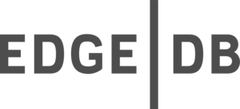

# Todos

Todos App is a good example of application to demonstrate a simple CRUD (Create, Read, Update, Delete) application using any programming language.

As a developer, i love learning new programming languages and frameworks. So in this repository, i will try to implement the same application using different programming languages and frameworks.

### Todo Model

A `Todo` is a simple model with the following attributes:

- `id`: Unique identifier of the todo
- `label`: Label of the todo
- `completed`: Status of the todo (completed or not)


### Todo API

The API of the application is very simple and has the following endpoints:

- `GET /todos`: List all todos
- `POST /todos`: Create a new todo
- `GET /todos/:id`: Get a todo by id
- `PUT /todos/:id`: Update a todo by id
- `DELETE /todos/:id`: Delete a todo by id

### Todo UI

The UI of the application is very simple and has only one page with the following features:

- List all todos
- Create a new todo
- Edit an existing todo label
- Mark a todo as completed
- Delete a todo
<div style="width: 100%; text-align: center;">
    
</div>

___

<details>
    <summary>
          Golang /  EdgeDB  /  Angular
    </summary>


- **Backend**: [Golang 1.20](https://golang.org/)

- **Frontend**: [Angular 16](https://angular.io/)

- **Database**: [EdgeDB v3](https://edgedb.com/)


#### 🛵 How to run the application ?

If you have `makefile` installed on your machine, you can run the following command to build and run the application:

````shell
 cd golang-edgeDB-angular && make build_and_run
````

or you can run the following commands:

````shell
cd golang-edgeDB-angular/front \
  && ng build  --output-path ../back/static \
  && cd ../back \
  && go run main.go
````
then open your browser and navigate to `http://localhost:3000/`.

 In this example, i've used <a href="https://golang.org/">Golang</a> as a backend language and <a href="https://gofiber.io/">Fiber v2 </a> framework to build the API.
Since I used version 1.20 of Golang, it was an opportunity to test the use of `generics` that appeared in version 1.18. 

An example of usage of generics in the project 👇

```go
package utils

type (
	Consumer[T any] func(T) error
	Supplier[T any] func() (T, error)
)

func HandleSup[T any](supplier Supplier[T], consumer Consumer[T]) error {
	if t, err := supplier(); err != nil {
		return err
	} else {
		return consumer(t)
	}
}
```


 To store the data, i've chosen <a href="https://edgedb.com/">EdgeDB</a> as a database. It is a new database built on top of PostgreSQL. 
It is a very interesting database with a really nice type system an a powerful query language. 

An example of schema to define the Todo model 👇
``` sql
module default {

    type Todo {
        required label: str {
            constraint min_len_value(1);
        }
        completed: bool {
            default := false;
        }
        
        constraint exclusive on ( str_trim( str_lower( .label ) ) );
    }
}
```

An example of query to get a todo by id 👇
```sql
SELECT default::Todo {
    id,
    label,
    completed
} FILTER .id = <uuid>$0;
```

and to check if a todo with a specific label exists:

``` sql
SELECT count( 
    (SELECT default::Todo FILTER .lable = <str>$0)
) > 0;
```

I highly recommend you to check it out 😉.

 For the frontend, i've used <a href="https://angular.io/">Angular</a> framework, 
<a href="https://angular.io/guide/signals">Angular Signals</a> instead of <a href="https://rxjs.dev/">RxJS</a>
and <a href="https://ngrx.io/">NgRx</a> to manage the state of the application with Redux pattern.

</details>
<br>

<details>
    <summary>
          Rust /  SurrealDB  /  Elm
    </summary>

- **Backend**: [Rust 1.71.0](https://www.rust-lang.org/)

- **Frontend**: [Elm 0.19.1](https://elm-lang.org/)

- **Database**: [SurrealDB v1.0.0-beta.9+20230402](https://surrealdb.com/)


#### 🛵 How to run the application ?

If you have `makefile` installed on your machine, you can run the following command to build and run the application:

````shell
 cd rust-surrealDB-Elm && make build_and_run
````

or you can run the following commands:

````shell
cd rust-surrealDB-Elm/front \
  && ng build  --output-path ../back/static \
  && cd ../back \
  && cargo run 
````
then open your browser and navigate to `http://localhost:8080/`.

 For this second implementation of the todo-app, i've choosen <a href="https://rust-lang.org">Rust programming language</a>. It's not the easiest one but i love it. I've already try it before, but this time i've decided to give a try to one of its most popular web framework : <a href="https://rocket.rs/">Rocket rs</a>. It's a really good framework that provide `derive macros` to easily write API endpoints.  

````rust
#[post("/", data = "<request>")]
pub async fn create(request: Form<AddTodoRequest>, db: &State<DB>) -> Result<Json<TodoDto>, TodoError> {
    create_todo(request.into_inner(), db.inner()).await.map(Json)
}
````
<br>
<br>

 I love learning new stuffs, so for this example i've decided to try a new database. <a href="https://surrealdb.com/">SurrealDB</a> is a new database written in `Rust` that provide a sql-style query language. 

An example of query to check if a todo exist with a given label 👇
```sql
SELECT * FROM (
    SELECT * FROM count(
        (
            SELECT * FROM type::table($table)
            WHERE string::trim(string::lowercase(label)) = $label
        )
    )
)[0] > 0
```
</details>


<br><br>
